## Acknowledgements

- [Node.js](https://nodejs.org) - For providing the runtime environment to build scalable and fast server-side applications.
- [Express.js](https://expressjs.com) - For simplifying the creation of the backend RESTful API.
- [Netlify](https://www.netlify.com) - For providing reliable hosting and deployment for the front-end of the application.
- [Railway.app](https://railway.app) - For easy deployment of the backend services.
- [MongoDB](https://www.mongodb.com) - For providing a flexible and scalable NoSQL database.
- [Mongoose](https://mongoosejs.com) - For simplifying the interaction with MongoDB in Node.js applications.
- [React](https://reactjs.org) - For building the interactive and dynamic front-end of the application.
- [Redux](https://redux.js.org) - For managing global state across the React application.
- [bcrypt.js](https://www.npmjs.com/package/bcryptjs) - For securely hashing passwords in the backend.
## Appendix

### Features

- **Add Products to Cart**: Users can browse the product catalog and add products to their shopping cart. The cart is updated dynamically using React and Redux for state management.
  
- **User Authentication**: Users can register and log in to their accounts. This is secured with **JWT (JSON Web Tokens)** for authentication, allowing users to access personalized features like order history or saved cart items.
  
- **Search Functionality**: Implemented a product search feature to help users quickly find products based on keywords, categories, or price ranges. The search results are dynamically displayed as users type in the search bar.

- **Routing Between Pages**: The app uses **React Router** to navigate between different pages such as the home page, product detail page, cart page, and user login/signup pages.

- **Redux for State Management**: Redux is used to manage the global state of the application, including cart items, user authentication status, and product information. This allows seamless data flow across different components and pages.

### Project Background

This project was developed as part of my **5th semester diploma work** for learning **full-stack development**. I first created the **front-end** with React to showcase product listings, cart functionalities, and user interactions. Then, I focused on learning **back-end development**, where I used **Node.js**, **Express.js**, and **MongoDB** to handle user authentication, product management, and storing orders. The application is deployed on **Netlify** for the front-end and **Railway.app** for the back-end.

 
### Known Issues

- There are occasional delays in loading product images on slower connections. We're working on optimizing this.
  
- Some mobile users have reported difficulties logging out. A fix will be rolled out soon.

### References

- [React Documentation](https://reactjs.org/docs/getting-started.html) - Official guide for learning React.
- [Redux Documentation](https://redux.js.org/introduction/getting-started) - Official guide for Redux state management.
- [Node.js Documentation](https://nodejs.org/en/docs/) - Official Node.js documentation.
- [Express.js Documentation](https://expressjs.com/en/starter/installing.html) - Official guide for Express.js.
- [JWT.io](https://jwt.io) - For understanding and implementing JSON Web Tokens for secure authentication.
- [MongoDB Documentation](https://www.mongodb.com/docs/) - Guide to using MongoDB in applications.

## Demo

You can view the live demo of the eCommearc Bazaar application by clicking the link below:

[**E-Commearc Bazaar Live Demo**](https://ecommearcbazaar.netlify.app/)
## Features

- **Product Catalog**: View a wide range of products with sorting and filtering options to help users find what they're looking for.
- **User Authentication**: Register, log in, and manage user profiles securely with JWT authentication.
- **Shopping Cart**: Add products to the cart, update quantities, and view total price.
- **Search Functionality**: Search for products by keywords, categories, or price range to quickly find desired items.
- **Product Details**: View detailed product information, including images, descriptions, and pricing.
- **Responsive Design**: Optimized for a seamless shopping experience across mobile, tablet, and desktop devices.
- **State Management with Redux**: Global state management for cart, user, and product data to ensure smooth user experience.
- **Routing with React Router**: Navigate between pages like Home, Product Detail, Cart, and Login seamlessly.

  ## Images
 - **login** :
    
  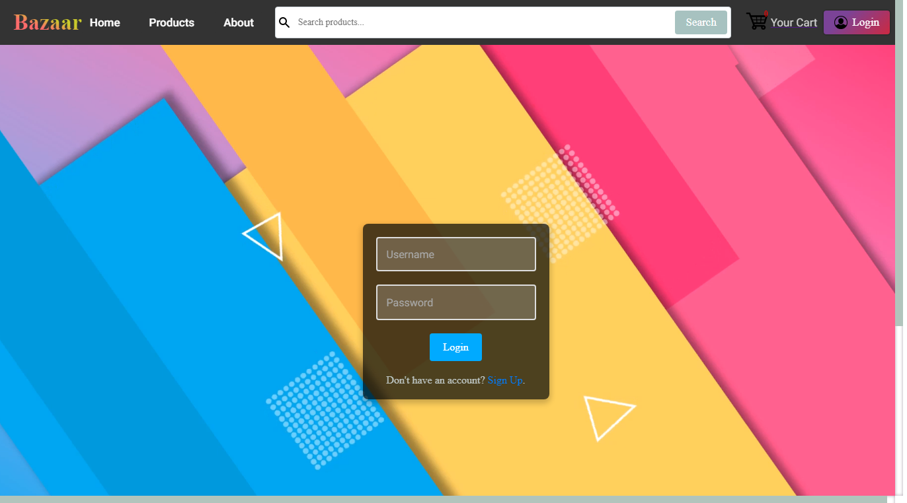

 - **sign up** :
 
  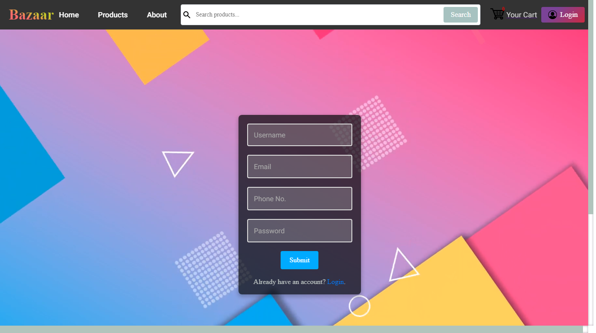

 - **home pages** :
 
  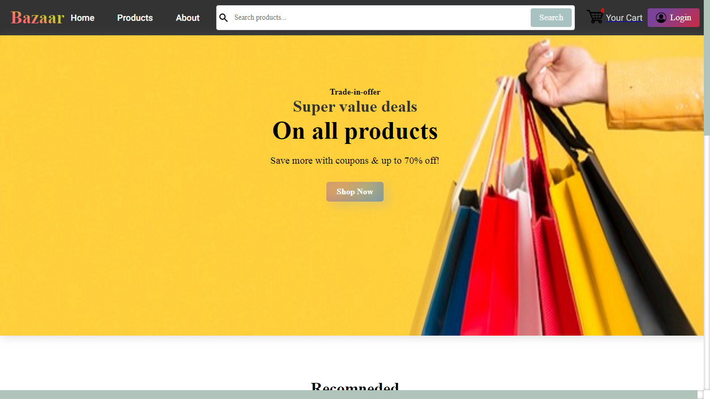

  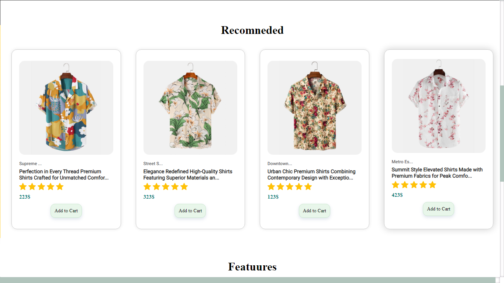
  
  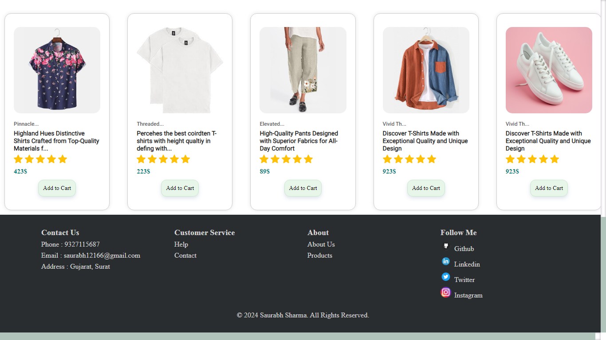

 - **product pages** :
  
  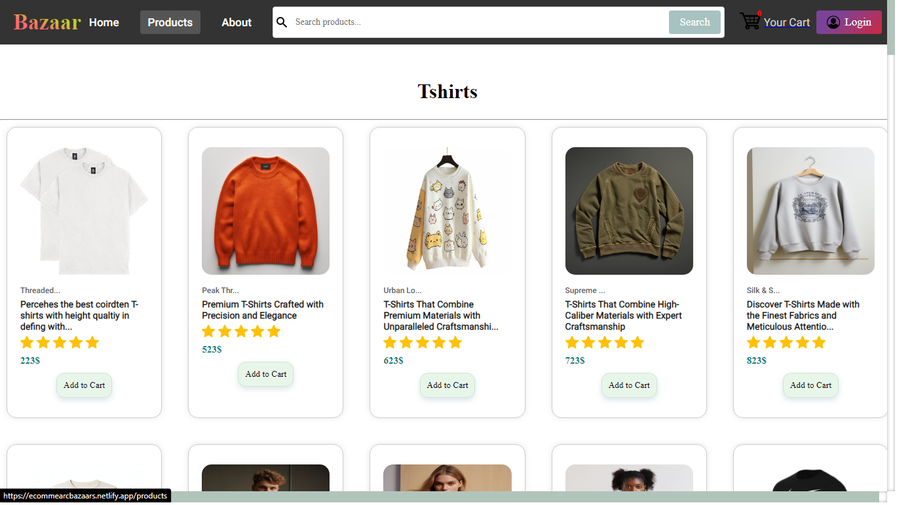

  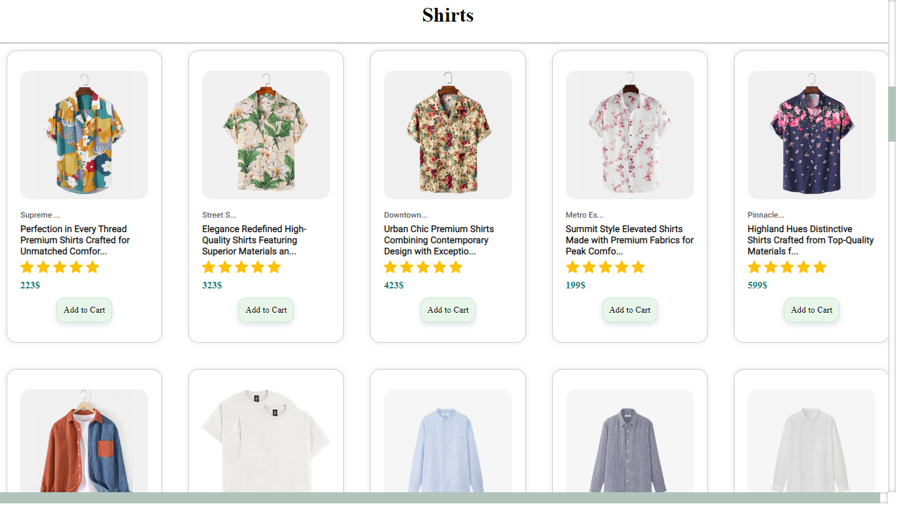

  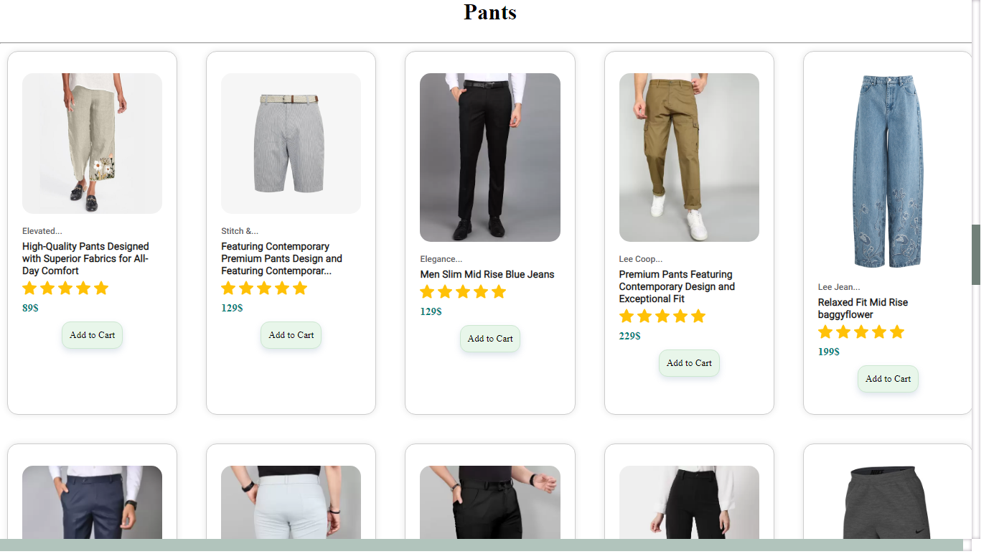
  
  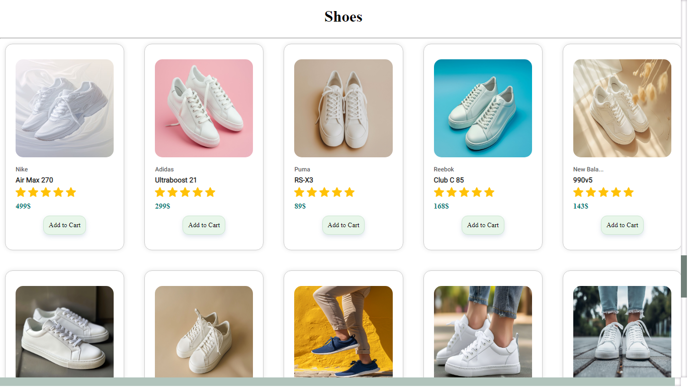
 
 - **add to cart page** : 
  
  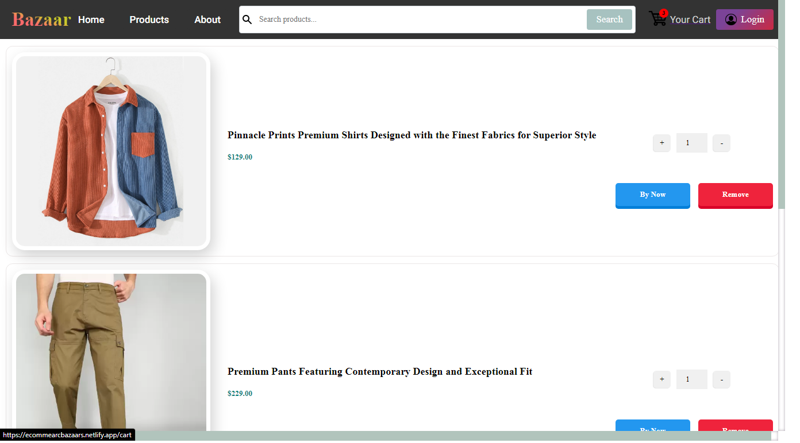
  
  ## Deployment
  
 - **becakend Image** : 
  
  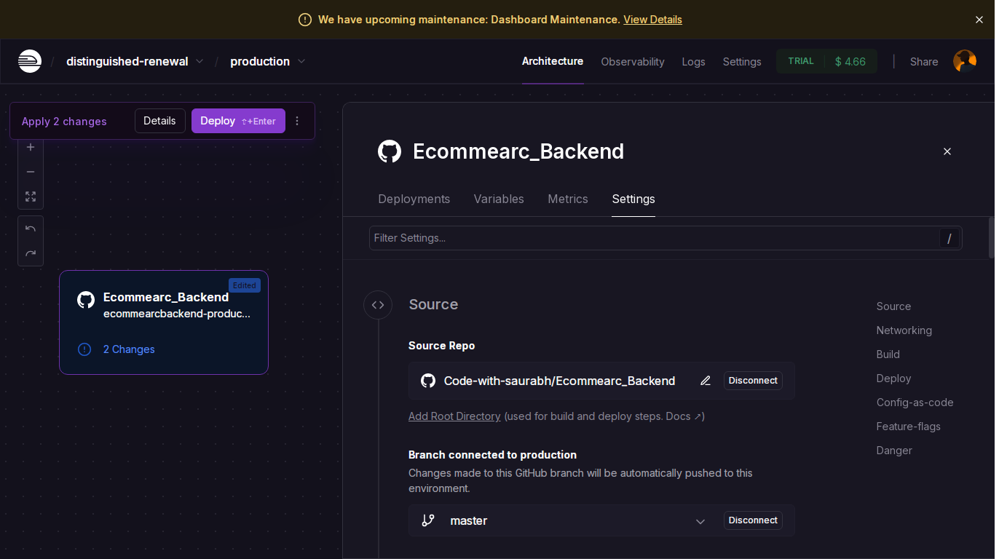
  
 - **database** : 
  
  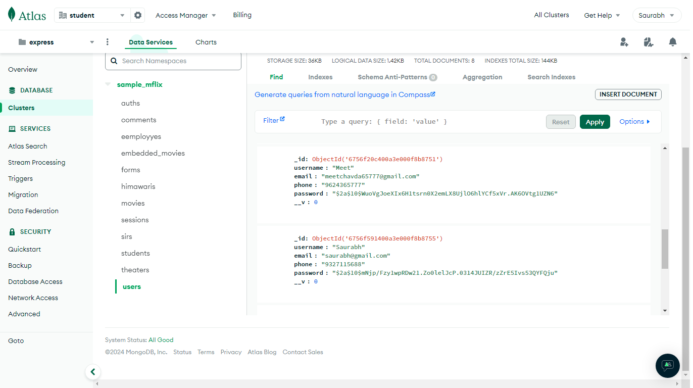
  
 - **frontend** :

  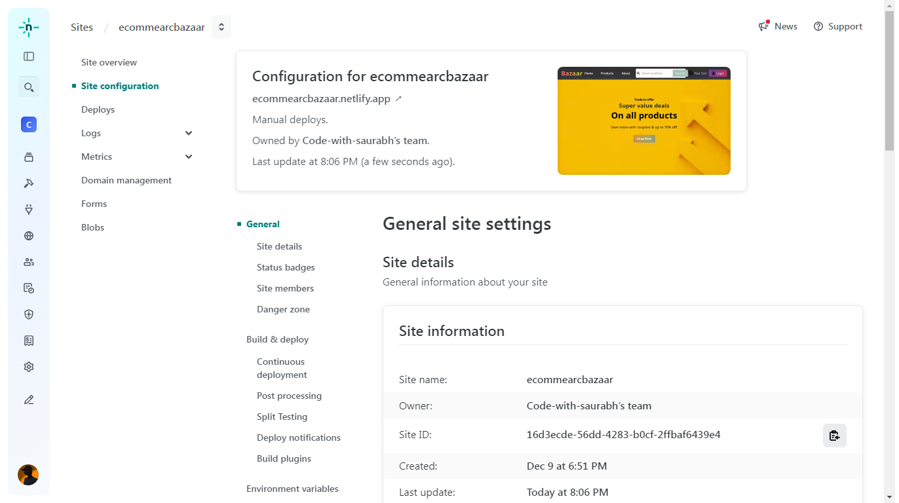
  
  
